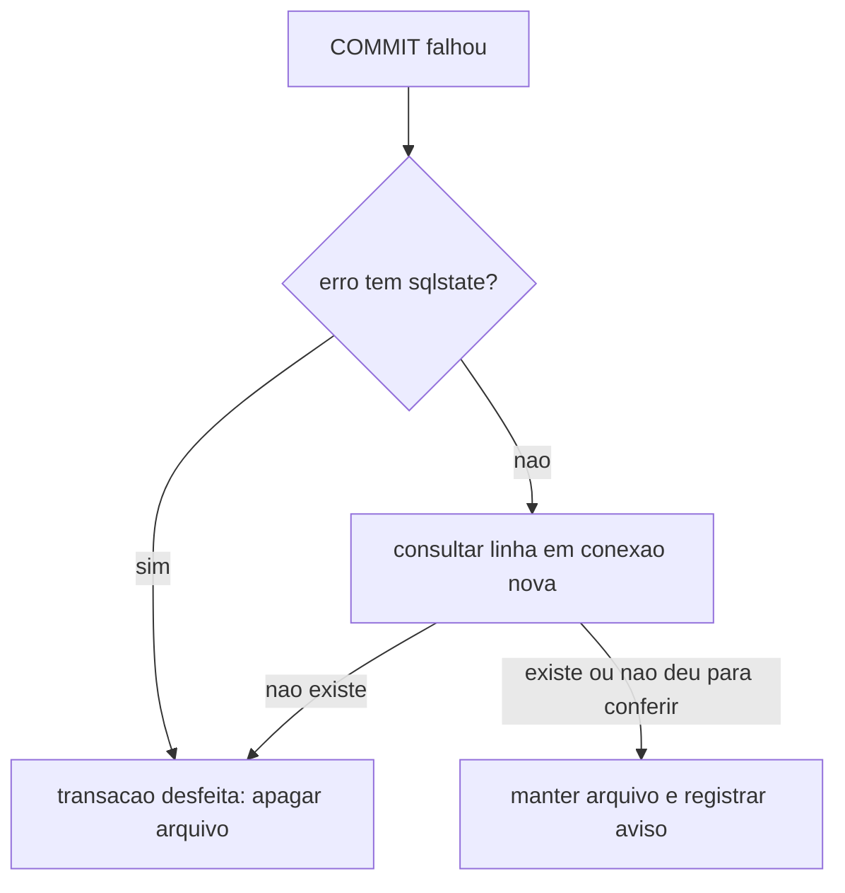

# Commit ambiguo - se a conexao cai no COMMIT, conferir a linha antes de apagar o arquivo

## Contexto

Fluxo "salva o arquivo em disco, depois grava a linha no banco" (ex.: upload de imagem). Se o `COMMIT` falha, o codigo precisa decidir se apaga o arquivo.

## Problema

Se a conexao cai durante o `COMMIT`, o servidor pode ter gravado a linha antes de a confirmacao chegar. Apagar o arquivo nesse caso deixa uma linha apontando para arquivo inexistente (pior que um arquivo orfao).

## Solucao

Classificar o erro pelo `sqlstate` (ver [[SQLAlchemyError no log: registrar classe e sqlstate, nunca str(erro) inteiro]]):

- **Erro com `sqlstate`** (ex.: 57014 timeout, 23xxx integridade): o servidor respondeu e desfez a transacao. Pode apagar o arquivo.
- **`OperationalError` sem `sqlstate`** (conexao perdida): resultado ambiguo. Consultar `SELECT 1 FROM tabela WHERE coluna = :arquivo` numa **conexao nova**:
  - `False`: a linha nao existe, apagar o arquivo.
  - `True`, ou nao foi possivel conferir: **manter o arquivo** e registrar no log (aviso). Arquivo orfao e melhor que linha quebrada.

## Trade-offs

- **Ganha:** nunca deixa linha apontando para arquivo inexistente.
- **Perde:** pode sobrar arquivo orfao (precisa de limpeza periodica); a conferencia extra pode falhar enquanto o servidor se recupera.

## Evidencia

Implementado e testado na T-0013 com monkeypatch de `commit` (4 casos). A Seguranca reproduziu a queda real com [[Simular queda de conexao durante o COMMIT do PostgreSQL com gatilho adiado e pg_sleep]]: com `sqlstate` 57P01 o arquivo foi apagado; sem `sqlstate` o arquivo ficou como orfao com `log.warning`. O ramo "COMMIT gravado e confirmacao perdida" so foi testado por monkeypatch.

## Quando NAO usar

Quando o arquivo e gravado depois do commit, ou quando o armazenamento e idempotente e uma limpeza periodica ja remove orfaos (a conferencia vira custo sem ganho).

## Relacionadas

- [[Simular queda de conexao durante o COMMIT do PostgreSQL com gatilho adiado e pg_sleep]]: experimento que reproduz os dois casos acima.
- [[statement_timeout se passa em options da libpq e vira QueryCanceled no psycopg 3]]: origem do erro com `sqlstate` 57014, tratado como definitivo.
- [[SQLAlchemyError no log: registrar classe e sqlstate, nunca str(erro) inteiro]]: como ler o `sqlstate` do erro.

## Decisao do Bibliotecario

Promovido a padrao em `10_Conhecimento` (2026-10-04). Sem duplicata no Brain (busca por "COMMIT", "ambiguo", "orfao"). Ligado ao experimento que o sustenta.
