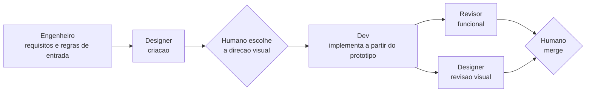

# Fluxo de design

O Designer tem dois modos: **criacao** (desenha antes do codigo) e **revisao visual** (avalia o que o Dev implementou). A ideia central: o Designer comeca livre, pela imagem, e so no fim chega ao codigo. Assim a solucao visual nao nasce presa ao que ja existe no HTML.

## Onde a funcionalidade com interface passa

Tarefa pequena de interface pode pular o Engenheiro. Tarefa sem interface nao passa pelo Designer.

## Modo criacao (cartao com `papel: designer`)

Artefatos em `docs/design/T-####/` do projeto:

| Etapa | O que o Designer produz | Arquivo | Liberdade |
|---|---|---|---|
| 0. Brief | Entende o pedido: objetivo, publico, tom, conteudo real da tela, restricoes (acessibilidade, marca) | `01-brief.md` | Pergunta o que faltar (Passos do humano) |
| 1. Conceito (imagem) | **2 ou 3 direcoes visuais diferentes** para a mesma tela: composicao, cores, tipografia, clima | `02-conceito-A.svg`, `-B`, `-C` (ou `.png` se houver gerador de imagem) | **Maxima**: pode ignorar o layout atual |
| - | **Humano escolhe** uma direcao (ou mistura): o Designer para com status `aguardando-humano`; o humano anota a escolha no brief e volta o status para `pronta` | Passos do humano do cartao | - |
| 2. Esqueleto (SVG) | Estrutura da direcao escolhida: grade, hierarquia, blocos anotados com o nome do componente, versao desktop e celular | `03-esqueleto.svg` | Media |
| 3. Prototipo (HTML/CSS) | Pagina estatica, autocontida, com conteudo realista e estados (vazio, erro, sucesso) | `04-prototipo.html` | Baixa: segue o esqueleto |
| 4. Entrega ao Dev | Tokens (cores, fontes, espacamentos como variaveis CSS), componentes, estados, comportamento no celular, requisitos de acessibilidade | `05-entrega.md` + `docs/design/sistema/tokens.css` | - |

Regras:
- O Designer **nunca** altera o codigo da aplicacao (`app/`, templates reais). Quem implementa e o Dev, a partir do prototipo.
- A imagem do conceito e inspiracao, nao fonte de verdade. A fonte de verdade da interface e o prototipo HTML + os tokens.
- Tokens aprovados vao para `docs/design/sistema/` e passam a valer para as proximas telas (o sistema de design cresce a cada tarefa).
- No cartao de criacao (`papel: designer`), a secao "Revisao visual" leva "Dispensada: executor e o Designer (tarefa de criacao)". A revisao visual acontece depois, no cartao do Dev que implementa o prototipo.

## Modo revisao visual (cartao em `revisao` com `interface: sim`)

1. Sobe a aplicacao do branch num projeto Compose e porta proprios (convencao no `CLAUDE.md` do projeto).
2. Compara o resultado com o prototipo e o `05-entrega.md`, em largura de desktop e de celular.
3. Avalia: hierarquia visual, legibilidade, espacamento, consistencia com os tokens, estados (vazio, erro, sucesso), responsividade e acessibilidade basica (contraste AA, foco visivel, rotulos nos campos, mensagens de erro claras).
4. Registra cada observacao em `qualidade/ux/UX-####.md` com severidade:
   - **bloqueante**: impede uso ou falha grave de acessibilidade;
   - **recomendado**: deveria entrar nesta tarefa;
   - **sugestao**: ideia para depois.
5. Preenche a secao **Revisao visual** do cartao. O Designer **nao muda o status**: o Revisor considera as observacoes bloqueantes na decisao (`aprovada` ou `correcao`). Por isso o Designer revisa **antes** do Revisor fechar.

**Como ver a pagina** ([[ADM-0025]]): o caminho padrao e a extensao Claude in Chrome, que exige o Chrome do humano aberto e o servidor local rodando em segundo plano (`run_in_background`), senao ele morre quando o comando termina. Se a extensao nao estiver conectada, a revisao visual usa o Chrome headless do terminal com o CDP (`Emulation.setDeviceMetricsOverride` para medir 360 px), com script temporario no scratchpad da sessao, e registra como lacuna so o que o headless nao cobre (toque real, leitor de tela).

## Como o Designer "enxerga"

| Situacao | Hoje | Proximo passo (skills) |
|---|---|---|
| Ver o proprio SVG/PNG | Le o arquivo (o modelo entende imagem) | - |
| Ver o HTML renderizado e a aplicacao rodando | Extensao Claude in Chrome (Chrome do humano aberto); sem ela, Chrome headless com CDP em desktop e 360 px | - |
| Gerar imagem raster no conceito | Conceito em SVG colorido | Skill de geracao de imagem |

## Lancador

- Criacao: `D:\01_IA\ferramentas\papel designer` num worktree cuja tarefa tem `papel: designer` (status `pronta`, `em-andamento` ou `correcao`).
- Revisao visual: o mesmo comando num worktree cuja tarefa esta em `revisao` com `interface: sim`.
