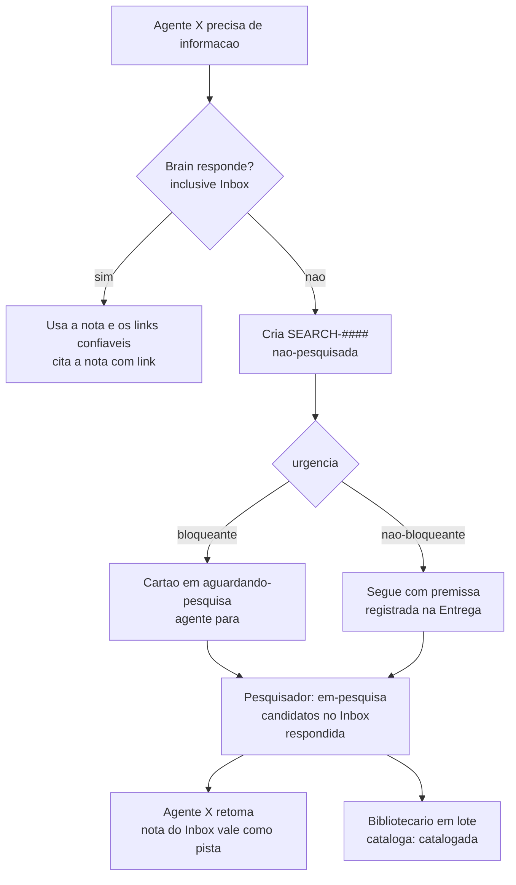

# Fluxo de pesquisa

Pesquisa na internet e trabalho do [[Pesquisador]]. Os demais papeis consultam o Brain e os **links confiaveis** das notas; o que nao estiver la vira um pedido `SEARCH-####`. Decisao: [[ADR-0017 Papel Pesquisador e internet por fontes confiaveis]].

## Fluxo

## Status do SEARCH

| Status | Quem muda | Significa |
|---|---|---|
| `nao-pesquisada` | Quem pede | Pedido criado |
| `em-pesquisa` | Pesquisador | Pesquisa em andamento |
| `respondida` | Pesquisador | Candidatos no Inbox; o pedinte ja pode usar como pista |
| `sem-resposta` | Pesquisador | Nao ha fonte confiavel; o SEARCH diz o que foi tentado (resultado negativo tambem e conhecimento) |
| `catalogada` | Bibliotecario | Notas promovidas ou fundidas no Brain; SEARCH aponta as notas finais |

## Quem roda o que

1. **Quem pede** (qualquer papel): cria `operacao/pesquisas/SEARCH-####.md` com o template `Pesquisa`, proximo numero livre. Diz a pergunta exata, o contexto, o que ja buscou no Brain e para qual tarefa. Bloqueante: muda o cartao para `aguardando-pesquisa` e para.
2. **Coordenador**: mostra os SEARCH pendentes no panorama e diz ao humano quando rodar o Pesquisador. Com o SEARCH `respondida`, volta o cartao de `aguardando-pesquisa` para `em-andamento` e indica o papel a retomar.
3. **Pesquisador** (humano, terminal na copia principal): `D:\01_IA\ferramentas\papel pesquisador`.
4. **Bibliotecario** (em lote): cataloga os candidatos e muda os SEARCH para `catalogada`, com as notas finais.

## Internet por fontes confiaveis

- So o Pesquisador busca (WebSearch) e abre qualquer site.
- Os demais papeis abrem apenas os dominios de `agentes/fontes-confiaveis.json` (injetados no perfil pelo lancador). Outro site: o Claude pergunta ao humano. `curl` so em `localhost` (a aplicacao do projeto).
- Consultas de ferramentas de vulnerabilidade (`pip-audit`, `osv-scanner`) sao liberadas para a Seguranca: e dado da hora, nao navegacao.
- Dominio novo: o Pesquisador propoe no SEARCH; o humano inclui na lista.

## Pesquisa de pauta

O humano ou o Coordenador podem criar SEARCH sem tarefa (`tarefa: pauta`), por exemplo "catalogar as CWE mais relevantes para Python/FastAPI, uma nota por CWE". E assim que o Brain cresce fora do caminho das tarefas.
