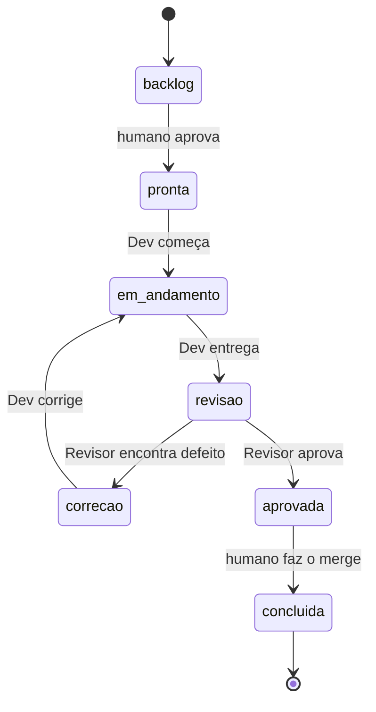

# Fluxo de tarefa

Equipe: **humano** (Product Owner e integrador), **Dev**, **Revisor** e **Bibliotecário**.

O repasse entre agentes acontece **por arquivos** — cartão da tarefa, commits e registros em `qualidade/` —, nunca copiando conversas. O humano só diz a cada papel quando começar.

## Três conceitos

| Conceito | O que define | Onde |
|---|---|---|
| **Onde** | A pasta em que o agente trabalha | Worktree da tarefa (criado no Orca) ou cópia principal `D:\01_IA` |
| **Quem** | O papel do agente: regras, permissões e modelo | Escolhido no lançador: `papel dev`, `papel revisor`, `papel bibliotecario` |
| **O quê** | A tarefa | Cartão `operacao/tarefas/T-####.md`, identificado pelo nome do worktree |

## Status do cartão

(`em_andamento` = `em-andamento` no cartão.)

## Passo a passo

1. **Cartão** (humano): criar ou revisar `operacao/tarefas/T-####.md` e mudar o status para `pronta`.
2. **Worktree** (humano): no Orca, *Create Worktree* no repositório do projeto, nome `T-####-descricao`, *Branch from* `main`, **terminal em branco** (não escolher agente).
3. **Dev** (humano digita no terminal do worktree): `D:\01_IA\ferramentas\papel dev`
   → o Dev implementa, commita, preenche a Entrega e muda o status para `revisao`.
4. **Revisor** (humano, no mesmo worktree, depois de fechar o Dev): `D:\01_IA\ferramentas\papel revisor`
   → o Revisor verifica, commita `VER-####` (e `BUG-`/`SEC-`) no branch e muda o status para `aprovada` ou `correcao`.
5. **Se `correcao`**: voltar ao passo 3. O Dev lê o VER e corrige. Depois, passo 4 de novo — **todo novo commit exige um novo VER**.
6. **Merge** (humano): com status `aprovada`, fazer o merge do branch na `main`, mudar o status para `concluida` e excluir o worktree no Orca.
7. **Bibliotecário** (humano, num terminal em `D:\01_IA`): `D:\01_IA\ferramentas\papel bibliotecario`
   → cura os candidatos do Inbox e commita.

## O lançador `papel`

Antes de abrir o Claude, ele confere a pasta, a tarefa e o status do cartão, e recusa com uma mensagem clara se algo estiver errado. Depois abre o Claude já no papel certo, com o pedido inicial ("Execute a tarefa T-0001", "Revise a tarefa T-0001", "Processe o Inbox do Brain").

| Papel | Onde roda | Status exigido do cartão | Modelo |
|---|---|---|---|
| `dev` | Worktree da tarefa | `pronta`, `em-andamento` ou `correcao` | Sonnet |
| `revisor` | Worktree da tarefa | `revisao` | Opus |
| `bibliotecario` | Cópia principal `D:\01_IA` | — | Sonnet |

Opções: `--verificar` (só confere, não abre o Claude) e `--sem-pedido` (abre sem o pedido inicial).

Para conferir que deu certo: o cabeçalho do Claude mostra `@dev`, `@revisor` ou `@bibliotecario`. Se uma sessão abrir sem papel, o próprio Claude avisa e os commits dela são recusados.
