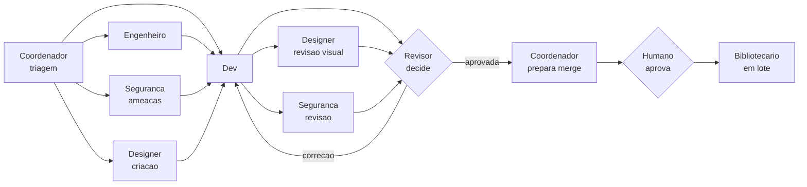
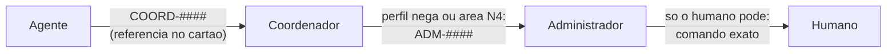
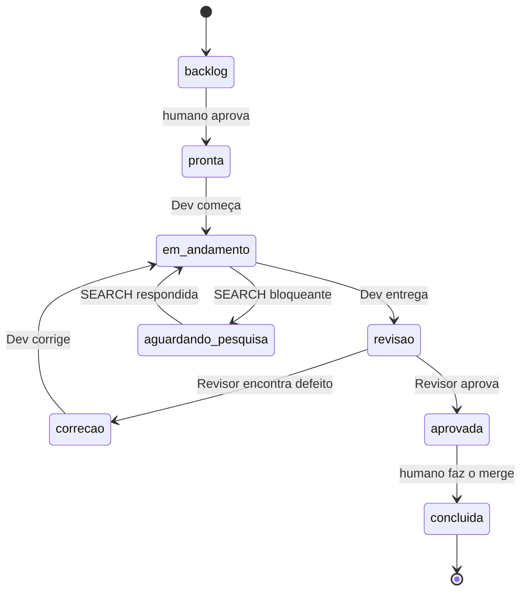

# Fluxo de tarefa

Equipe: **humano** (Product Owner e aprovador final), **Administrador** (age no lugar do humano no ambiente e nos merges, com aprovacao a cada mudanca: [[Administrador]]), **Coordenador**, **Engenheiro de Software**, **Designer**, **Seguranca**, **Dev**, **Revisor**, **Pesquisador** e **Bibliotecário**. Duvidas que o Brain nao responde viram `SEARCH-####` para o Pesquisador: [[Fluxo de pesquisa]]. O que exige area N4, decisao de ambiente ou push vira `ADM-####` em `operacao/administrador`, criado pelo Coordenador ([[ADR-0019 Pedidos ao Administrador em operacao]]).

O repasse entre agentes acontece **por arquivos** — cartão da tarefa, commits e registros em `qualidade/` —, nunca copiando conversas. O humano inicia cada papel com o lançador; o **Coordenador** diz qual é o próximo e prepara o que é operacional para o humano aprovar ([[ADR-0016 Papeis Coordenador e Seguranca]]).

## Três conceitos

| Conceito | O que define | Onde |
|---|---|---|
| **Onde** | A pasta em que o agente trabalha | Worktree da tarefa (criado no Orca) ou cópia principal `D:\01_IA` |
| **Quem** | O papel do agente: regras, permissões e modelo | Escolhido no lançador: `papel <papel>` — tem que bater com o campo `papel:` do cartão (ou com a marca, nos modos de revisão) |
| **O quê** | A tarefa | Cartão `operacao/tarefas/T-####.md`, identificado pelo nome do worktree |

## Quem entra em cada tarefa

O Coordenador confere isto na triagem, antes do cartão ir para `pronta`:

| Situacao da tarefa | Antes do Dev | Depois do Dev, antes do Revisor fechar |
|---|---|---|
| Sempre | - | Revisor (decide) |
| Entrada de usuario (formulario, upload, parametro) | Cartao do **Engenheiro**: regras de formato com exemplos validos e invalidos | - |
| Funcionalidade nova ou vaga, escolha de tecnologia | Cartao do **Engenheiro**: requisitos, modelos, ADR proposto | - |
| Muda a tela (`interface: sim`) | Cartao do **Designer** (criacao), se nao houver prototipo | **Designer** (revisao visual, `UX-####`) |
| Toca upload, autenticacao, dados pessoais, segredos, rede ou novas dependencias (`seguranca: sim`) | Cartao da **Seguranca** (analise de ameacas), se a tarefa for normal ou grande | **Seguranca** (revisao, `SEC-####`) |
| Tarefa trivial sem tela e sem risco | - | So o Revisor |

Os passos marcados sao opcionais conforme a tabela; o minimo e **Dev -> Revisor**. So o Revisor muda o status para `aprovada` ou `correcao`: Designer e Seguranca registram e ele considera os bloqueantes.

## Pedidos de comando

Quem precisa de algo que so o humano faria (comando fora do perfil, merge, push, Orca) ou encontra um erro inesperado nao pede ao humano: sobe a cadeia ([[ADR-0020 Cadeia de pedidos de comando]], [[ADR-0021 Pedidos ao Coordenador sempre em COORD e numeracao de qualidade por tarefa]]).

- Coordenador e Administrador executam com o clique de aprovacao do humano; o humano so digita o que e dele (Orca, lancador `papel`, senha, `sudo`).
- Sempre `operacao/coordenador/COORD-####.md`, com ou sem tarefa; o cartao guarda so a referencia na secao "Pedidos ao Coordenador". Ao humano, o agente diz so o numero do pedido.
- **Erro inesperado** (ferramenta falhou, arquivo ausente, permissao negada, lancador recusou, conflito de merge): `COORD-####` com o erro exato, o que tentava fazer e a pasta. O Coordenador avalia a causa e propoe a melhoria.
- **Passos do humano** no cartao: so decisoes e acoes exclusivas do humano.

## Status do cartão

(`em_andamento` = `em-andamento` e `aguardando_pesquisa` = `aguardando-pesquisa` no cartão.)

## Passo a passo

0. **Coordenador** (humano, terminal na cópia principal): `D:\01_IA\ferramentas\papel coordenador`
   → mostra o panorama e faz a triagem do cartão (tabela acima). Com o "sim" do humano, muda o cartão para `pronta` e diz o próximo comando.
1. **Cartão** (humano, com o Coordenador): criar ou revisar `operacao/tarefas/T-####.md`, com as marcas `interface:` e `seguranca:`, e mudar o status para `pronta`.
   **Funcionalidade com entrada de usuario** (formulario, upload, parametro): antes do cartao do Dev, um cartao do **Engenheiro** define as regras de formato de cada campo com exemplos validos e invalidos. O cartao do Dev so fica `pronta` depois disso. (Retrospectiva da T-0002: regra ambigua virou o BUG-0003.)
2. **Worktree** (humano): no Orca, *Create Worktree* no repositório do projeto, nome `T-####-descricao`, *Branch from* `main`, **terminal em branco** (não escolher agente).
3. **Dev** (humano digita no terminal do worktree): `D:\01_IA\ferramentas\papel dev`
   → o Dev implementa, commita, preenche a Entrega e muda o status para `revisao`.
4. **Designer e Seguranca** (se `interface: sim` / `seguranca: sim`), no mesmo worktree, um de cada vez: `papel designer`, `papel seguranca`
   → registram `UX-####` / `SEC-####` e preenchem "Revisao visual" / "Revisao de seguranca" **sem mudar o status**.
5. **Revisor** (humano, no mesmo worktree, depois de fechar os anteriores): `D:\01_IA\ferramentas\papel revisor`
   → o Revisor verifica, commita `VER-####` (e `BUG-`) no branch e muda o status para `aprovada` ou `correcao`, considerando os UX e SEC bloqueantes.
6. **Se `correcao`**: voltar ao passo 3. O Dev lê o VER, os BUG e os SEC e corrige. Depois, passos 4 e 5 de novo — **todo novo commit exige um novo VER**.
7. **Merge** (Coordenador prepara, humano aprova): com status `aprovada`, o Coordenador confere VER e bloqueantes, faz o merge `--no-ff` na `main` com o "sim" do humano, executa os Pedidos ao Coordenador pendentes (com aprovação), muda o status para `concluida` e faz push com aprovação. O humano exclui o worktree no Orca.
   Problema depois de `aprovada` (ex.: conflito no merge): o Revisor **nao volta** e o cartao nao retorna para `revisao`. O Coordenador aborta o merge, registra um `COORD-####` com o erro e decide o proximo passo com o humano.
8. **Bibliotecário** (humano, num terminal em `D:\01_IA`, quando houver candidatos no Inbox): `D:\01_IA\ferramentas\papel bibliotecario`
   → cura os candidatos do Inbox e commita.

### Tarefas de engenharia (`papel: engenheiro` no cartão)

Mesmo fluxo, com três diferenças:

- No passo 3 o comando é `D:\01_IA\ferramentas\papel engenheiro`. O Engenheiro escreve só em `docs/` (requisitos, modelos Mermaid, avaliações, ADRs `proposta`) e cria os **cartões de implementação** em `backlog`.
- O Revisor verifica a documentação pela coluna "Documentação de projeto" da matriz de verificação.
- Antes do merge, o humano responde as questões em aberto e **aceita ou rejeita os ADRs** (muda o `status` do ADR). Depois, revisa os cartões de implementação criados e muda para `pronta` os que quiser executar.

Guia de modelagem: [[Padroes de modelagem]].

### Tarefas de seguranca (`papel: seguranca` no cartao)

- No passo 3 o comando e `papel seguranca`. A Seguranca escreve `docs/seguranca/T-####-ameacas.md` e propoe criterios de aceite para o cartao do Dev (o humano aprova e copia).
- O Revisor verifica a documentacao como numa tarefa de engenharia.

### Tarefas com interface (`interface: sim` no cartao)

- **Antes do Dev:** um cartao do Designer (`papel: designer`) cria a experiencia visual: brief, conceitos, esqueleto SVG, prototipo HTML e entrega. O humano escolhe a direcao visual no meio do caminho (status `aguardando-humano`).
- **Na revisao:** passo 4 acima.
- Fluxo completo: [[Fluxo de design]].

## O lançador `papel`

Antes de abrir o Claude, ele confere a pasta, a tarefa e o status do cartão, e recusa com uma mensagem clara se algo estiver errado. Depois abre o Claude já no papel certo, com o pedido inicial. No Linux: `$IA_RAIZ/ferramentas/papel.sh <papel>`.

| Papel | Onde roda | Status exigido do cartão | Modelo |
|---|---|---|---|
| `administrador` | Cópia principal `D:\01_IA` (`main` ou `admin/*`), com senha | — | Opus |
| `coordenador` | Cópia principal `D:\01_IA` (`main`) | — | Opus |
| `engenheiro` | Worktree da tarefa | `pronta`, `em-andamento` ou `correcao` (cartão com `papel: engenheiro`) | Opus |
| `dev` | Worktree da tarefa | `pronta`, `em-andamento` ou `correcao` (cartão com `papel: dev`) | Sonnet |
| `designer` | Worktree da tarefa | criacao: `pronta`/`em-andamento`/`correcao` com `papel: designer`; revisao visual: `revisao` com `interface: sim` | Opus |
| `seguranca` | Worktree da tarefa | analise: `pronta`/`em-andamento`/`correcao` com `papel: seguranca`; revisao: `revisao` com `seguranca: sim` | Opus |
| `revisor` | Worktree da tarefa | `revisao` | Opus |
| `pesquisador` | Cópia principal `D:\01_IA` (`main`) | — (atende `operacao/pesquisas`) | Sonnet |
| `bibliotecario` | Cópia principal `D:\01_IA` (`main`) | — | Sonnet |

Opções: `--verificar` (só confere, não abre o Claude), `--sem-pedido` (abre sem o pedido inicial) e `--continuar` (retoma a última sessão da pasta).

Para conferir que deu certo: o cabeçalho do Claude mostra `@coordenador`, `@dev`, `@revisor` etc. Se uma sessão abrir sem papel, o próprio Claude avisa e os commits dela são recusados.
