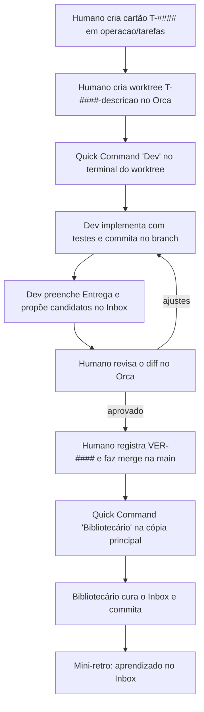

# Fluxo de tarefa (fase 1)

Equipe da fase 1: **humano** (Product Owner, revisor, integrador), **Dev** e **Bibliotecário**.



## Passo a passo

1. **Cartão.** Criar `operacao/tarefas/T-####.md` com o template `Tarefa`: objetivo, contexto, critérios de aceite, restrições, verificações obrigatórias. Status `pronta`.
2. **Worktree.** No Orca: *Create Worktree* no repositório do projeto, nome `T-####-descricao-curta`, *Branch from* `main`, terminal em branco. Nunca usar o item do repositório principal da barra lateral.
3. **Dev.** Rodar o Quick Command `Dev` no terminal do worktree e pedir: "Execute a tarefa T-####".
4. **Entrega.** O Dev preenche a seção Entrega do cartão e, se houver, cria candidatos em `BRAIN/00_Inbox`. Status `revisao`.
5. **Revisão.** O humano revisa o diff no Orca (comentários no diff voltam para o Dev). Registra `qualidade/verificacoes/VER-####.md` no projeto, incluindo o que não foi verificado.
6. **Merge.** O humano faz o merge do branch na `main` e exclui o worktree no Orca. Status `concluida`.
7. **Curadoria.** Na cópia principal `D:\01_IA`, rodar o Quick Command `Bibliotecário` e pedir: "Processe o Inbox".
8. **Retro.** Uma linha sobre o que funcionou e o que mudar, como candidato do tipo `aprendizado`.

## Quick Commands (Orca)

Terminal PowerShell. Cada papel define `IA_PAPEL` (usado pelos hooks do Git) e inicia o Claude com sua definição e seu perfil de permissões.

**Dev** (no terminal do worktree da tarefa):

```powershell
$env:IA_PAPEL='dev'; $env:IA_MODELO='sonnet'; claude --agent dev --add-dir D:/01_IA/agentes --settings D:/01_IA/agentes/perfis/dev.json
```

**Bibliotecário** (na cópia principal `D:\01_IA`):

```powershell
$env:IA_PAPEL='bibliotecario'; $env:IA_MODELO='sonnet'; claude --agent bibliotecario --add-dir D:/01_IA/agentes --settings D:/01_IA/agentes/perfis/bibliotecario.json
```
